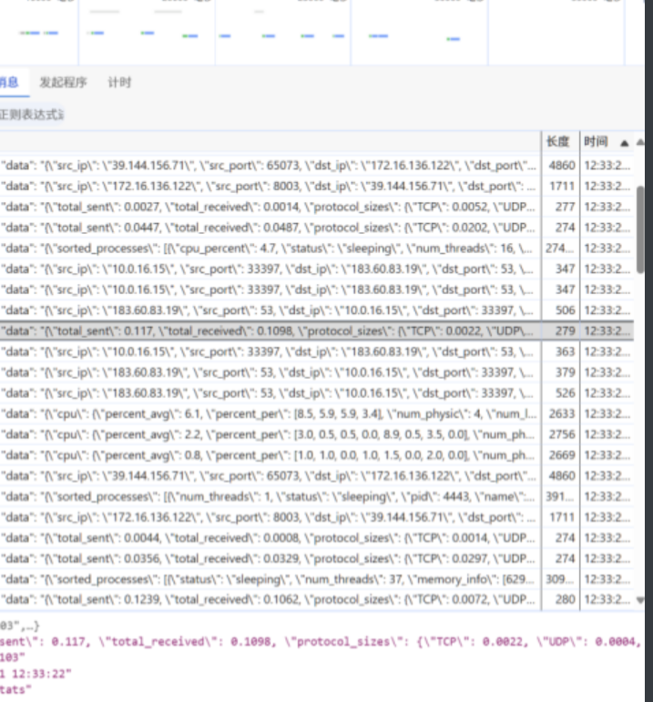

# longersking-hids

### 后台运行
使用：
```bash
nohup uvicorn app.main:app --host 0.0.0.0 --port 8003 --workers 8 > uvicorn.log 2>&1 &
```
客户端：
```bash
nohup python3 main.py > run.log 2>&1
```


更简单的方式：
```bash
yum install screen
```

在服务端：
```bash
screen -S server
cd dirs
python3 run.py
```
如果想要回到虚拟终端：
```bash
screen -r server
```


### 安装依赖注意事项

1. 在安装pcapy之前，需要安装系统依赖：

对于CentOS/RHEL系统：

```bash
sudo yum install gcc libpcap-devel python3-devel
```
对于Debian/Ubuntu系统：

```bash
sudo apt-get install libpcap-dev
```
安装完成后，通过pip安装pcapy
```
pip install pcapy
```

如果通过pip安装出现编译错误，则使用编译安装：
```bash
git clone https://github.com/CoreSecurity/pcapy.git
cd pcapy
sudo python setup.py install
```

这里可能会出现如下所示的错误：
```text
python3: can't open file '/home/www/client/pcapy/pcapy/setup.py': [Errno 2] No such file or directory
[root@iZbp15nmuwio86x4sx2s1zZ pcapy]# python3 setup.py
Traceback (most recent call last):
  File "/home/www/client/pcapy/setup.py", line 49, in <module>
    save_init_posix = sysconfig._init_posix
AttributeError: module 'distutils.sysconfig' has no attribute '_init_posix'
```

修改setup.py的内容，将以下两行注释（如果有）：
```python
save_init_posix = sysconfig._init_posix
```

```python
sysconfig._init_posix = save_init_posix
```

重新运行setup.py即可安装。

终极解决方案：
如果安装之后运行遇到一系列错误，请直接：
```python
pip uninstall pcapy
pip install pcapy-ng
```

2. 安装ahocorasick的问题

ahocorasick通过pip安装指定的名称是pyahocorasick

### 技术选型


### 系统方案


### 数据储存与管理


### 用于界面和报告


### 实现原理


### 页面展示





